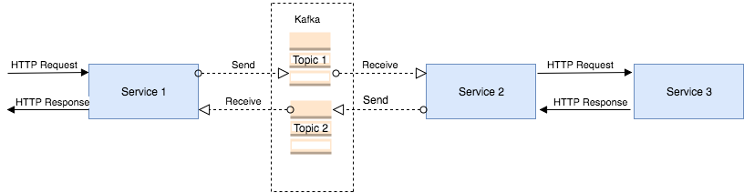
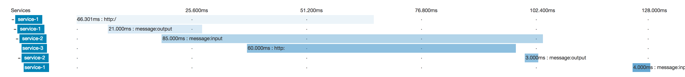
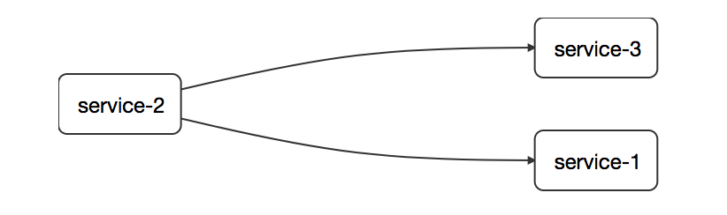

# Distributed logging POC with Sleuth and Zipkin

## Microservices flow
1. `Service1` will push a message to `topic1`
2. `Service2` will consume the message from `topic1`
3. `Service2` will send an HTTP request to `Service3`
4. `Service3` will send an HTTP response to `Service2`
5. `Service2` will push a message to `topic2`
6. `Service1` will consume the message from `topic2`

## Prerequisites
- Java 8
- Docker

## Container dependencies
- zookeeper
- kafka
- zipkin
- splunk

## Build microservices and running containers
`./run_containers.sh`

## Kill all containers
`./kill_all_containers.sh`

## Trigger the services
### Sleuth will generate the trace id
`curl http://localhost:8082`
### Use your own traced id by setting the right header (should be a hex value)
`curl --header "X-B3-TraceId: 616c646f313233" http://localhost:8082`

## Zipkin URL and query by trace id
`http://localhost:9411/`

## Splunk
### URL
`http://localhost:8000/`
### HTTP Listener
Added ENV variable to enable the TCP port 9997 in order to receive logs. See docker-compose file for more information.

## Zipkin screenshots
### Tracing a flow

### Services dependencies
